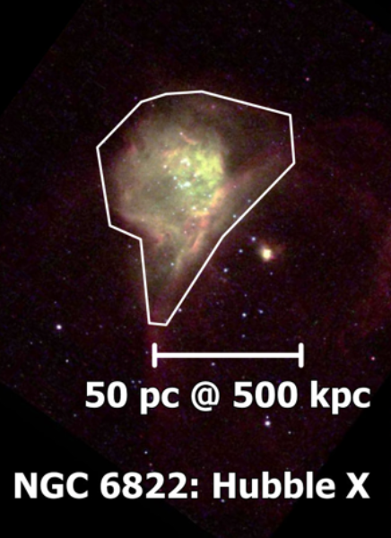

- Distance: $490 \pm 40 \text{ kpc}$ [1](https://ui.adsabs.harvard.edu/abs/2012A%26A...540A.135S/abstract)
- $1'' = 2.42 \text{ pc}$
- Diameter $D$: $160 \text{ pc}$ [[Kennicutt 1984|1]] 
- $L(Hα) = 1.62 \times 10^{38} \text{ erg/s}$ 
- $\text{log } L(Hα) = 38.21 \text{ erg/s}$ [1](https://ui.adsabs.harvard.edu/abs/2002MNRAS.329..481B/abstract)
- $\text{log } Q_0 =  \text{ photons/s}$ 
- $\sigma_\text{LOS} = 9.8 \text{ km/s}$ [[Terlevich and Melnick 1981|1]] , $10.5 \pm 0.02 \text{ km/s}$ [1](https://ui.adsabs.harvard.edu/abs/1986A%26A...160..374H/abstract)
- $Z = 0.0069$
# Images

- [HST](https://hubblesite.org/contents/media/images/2001/01/1012-Image.html)

# TAURUS

## Ha

