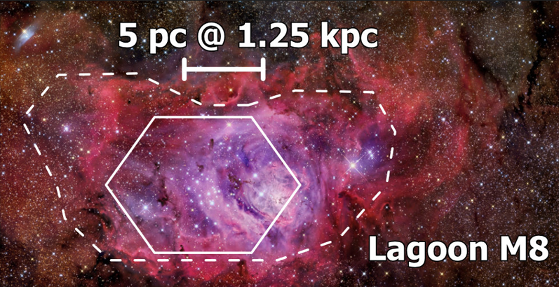

- Distance: $1.2 \pm 0.12 \text{ kpc}$ [1](https://ui.adsabs.harvard.edu/abs/2005A%26A...430..941P/abstract)
- $1'' = 0.006 \text{ pc}$
- Diameter $D$: $25 \text{ pc}$ [[Kennicutt 1984|1]] 
- $L(Hα) = 2.95 \times 10^{37} \text{ erg/s}$ 
- $\text{log } L(Hα) = 37.47 \text{ erg/s}$ 
- $\text{log } Q_0 =  \text{ photons/s}$ 
- $\sigma_\text{LOS} = 11.7 \pm 1.6 \text{ km/s}$ 
- $Z =0.0156 \pm 0.0032$  [1](https://articles.adsabs.harvard.edu/full/1993RMxAA..27....9P)
# Images

- [cosmotography](https://www.cosmotography.com/images/small_m8-m20.html)

---
# FLAMES

---
## Ha

