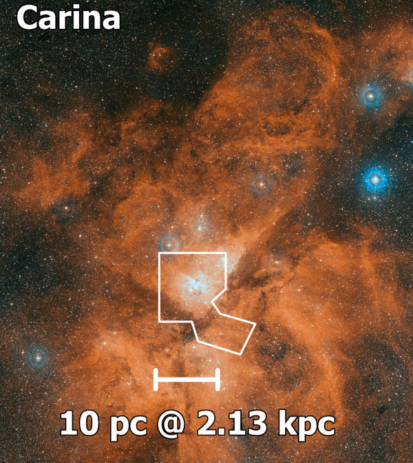

- Carina
- Distance: $2.35 \pm 0.05 \text{ kpc}$ [1](https://iopscience.iop.org/article/10.1086/503766/fulltext/)
- $1'' = 0.01 \text{ pc}$
- Diameter $D$: $200 \text{ pc}$ [[Kennicutt 1984|1]] 
- $L(Hα) = 1.02 \times 10^{39} \text{ erg/s}$ 
- $\text{log } L(Hα) = 39.01 \text{ erg/s}$ 
- $\text{log } Q_0 = 50.95 \text{ photons/s}$ [1](https://ui.adsabs.harvard.edu/abs/2008hsf2.book..138S/abstract)
- $\sigma_\text{LOS} = 18.6 \pm 3.3 \text{ km/s}$ 
- $Z =$ 

# Images

- [The Carina Nebula from the ground](https://esahubble.org/images/heic0707g/)

---
# FLAMES

## Ha

