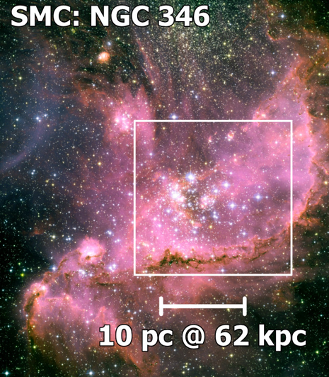

- Distance: $62 \pm 1 \text{ kpc}$ [1](https://ui.adsabs.harvard.edu/abs/2001ApJ...562..303D/abstract)
- $1'' = 0.3 \text{ pc}$
- Diameter $D$: $220 \text{ pc}$ [[Kennicutt 1984|1]] 
- $L(Hα) = 5.89 \times 10^{38} \text{ erg/s}$ 
- $\text{log } L(Hα) = 38.77 \text{ erg/s}$ [1](https://ui.adsabs.harvard.edu/abs/2010A%26A...517A..39H/abstract)
- $\text{log } Q_0 =  \text{ photons/s}$ 
- $\sigma_\text{LOS} \text{ (FWHM)} = 23.8 \text{ km/s}$ [1](https://ui.adsabs.harvard.edu/abs/2003ApJ...586.1179D/abstract)
- $Z = 0.0030$  [[Terlevich and Melnick 1981|1]]

# Images

- [HST](https://iopscience.iop.org/article/10.1086/503301/fulltext/)
- [Nota et al. 2006](https://iopscience.iop.org/article/10.1086/503301/fulltext/)

# MUSE

## Ha

