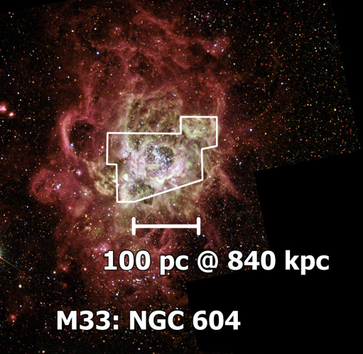

- Distance: $840 \pm 30 \text{ kpc}$ [1](https://ui.adsabs.harvard.edu/abs/2015MNRAS.449.4048K/abstract)
- $1'' = 4.07 \text{ pc}$
- Diameter $D$: $400 \text{ pc}$ [[Kennicutt 1984|1]] 
- $L(Hα) = 2.68 \times 10^{39} \text{ erg/s}$ 
- $\text{log } L(Hα) = 39.42 \text{ erg/s}$ [1](https://ui.adsabs.harvard.edu/abs/2002MNRAS.329..481B/abstract)
- $\text{log } Q_0 =  \text{ photons/s}$ 
- $\sigma_\text{LOS} = 17.8 \text{ km/s}$ [[Terlevich and Melnick 1981|1]] , $17.8 \pm 0.3 \text{ km/s}$
- $Z = 0.0126$ [[Terlevich and Melnick 1981|1]]

# Images

- [NGC 604 in Galaxy M 33](https://esahubble.org/images/opo9627a/)
- [HST](https://hubblesite.org/contents/media/images/2003/30/1423-Image.html) 
- [ESA HST](https://esahubble.org/images/heic1901b/)

# TAURUS

## Ha

