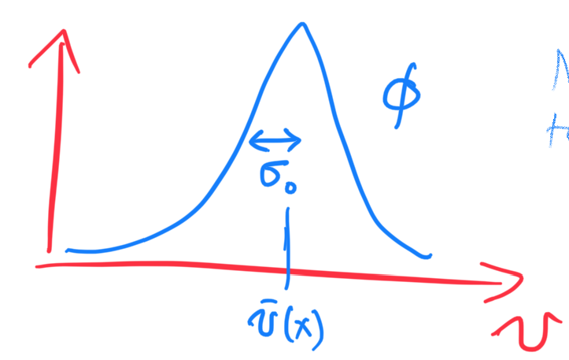
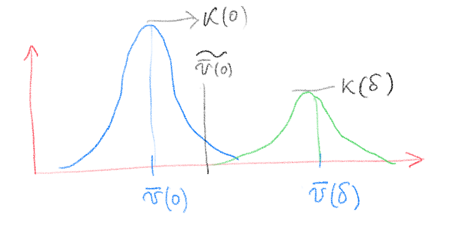
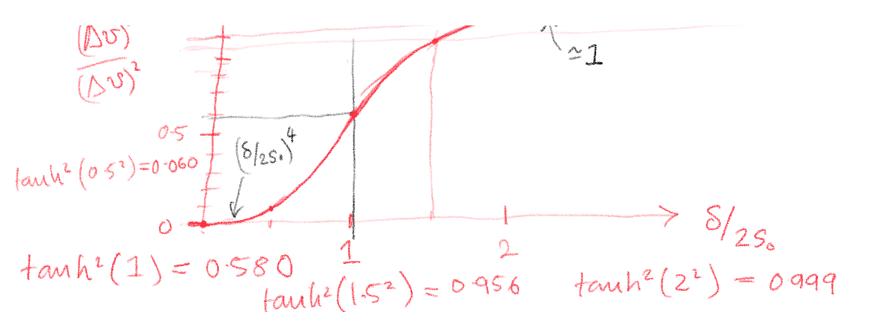
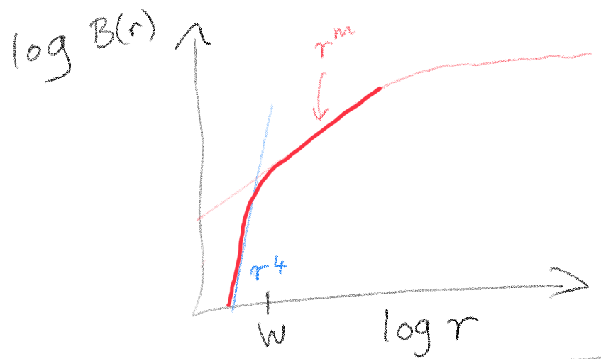

- [ ] Review

Modelo seeing. Convolución ancho de línea y seeing

$$e^{-\frac{s_0}{r_0}} \frac{1}{2} \left[1 + \tanh\left(a \ln\left(\frac{r}{2s_0}\right)\right)\right] \tag1$$

$$= \frac{e^{-\frac{s_0}{r_0}}}{1 + \left(\frac{r}{2s_0}\right)^{2a}} \tag2$$

Considerar las siguientes igualdades: 
$$\tanh(x) = 1 - \frac{2}{e^{2x} + 1} \quad ; \quad x = a \ln\left(\frac{r}{2s_0}\right)$$

$$ \frac{e^{-\frac{s_0}{r_0}}}{2} \left[1 + 1 - \frac{2}{e^{2x} + 1}\right] =
$$

$$e^{-\frac{s_0}{r_0}} \left[1 - \frac{2}{e^{2x} + 1}\right] = e^{-\frac{s_0}{r_0}} \left[\frac{e^{2x} + 1 - 1}{e^{2x} + 1}\right] =$$

$$ e^{-\frac{s_0}{r_0}} \left[\frac{e^{2x}}{e^{2x} + 1}\right] = e^{-\frac{s_0}{r_0}} \left[\frac{1}{1 + \frac{1}{e^{2x}}}\right]
$$

$$e^{2x} = e^{2a \ln\left(\frac{r}{2s_0}\right)} = \left(\frac{r}{2s_0}\right)^{2a}$$

$$\boxed{ \frac{e^{-\frac{s_0}{r_0}}}{1 + \left(\frac{r}{2s_0}\right)^{2a}} } \quad \quad \text{Q.E.D}$$

Effect of seeing on structure function

Assuming **uniform brightness** and **width**:
 
$$ I(x,v) = I_0 \phi(v, \overline{v} (x), \sigma_0)$$

 

Normalizes to 

$$\int_{-\infty} ^{\infty} \phi dv =1 $$

The only quantity that varies with position $x$ is the centroid velocity $\overline{v} (x)$. In general, $x$ is a 2d position on the plane of sky.

The seeing acts on each $v$-slice of the velocity cube (Even though $I_0 (x)$ is constant $I(x,v)$ is not constant with $x$ f...  fixed $v$ because $\overline{v} (x)$ is varying): 

$$ \hat{I} (x,v) = I(x,v) \otimes K*(x, s_0) $$

where $\otimes$ means the convolution operation and $K(x, s_0)$ is the seeing profile with width $s_0$:

$$ K(x, s_0) = \frac{1}{\sqrt{2 \pi s_0}}\exp (-x^2/2s_0^2)$$

with $\text{FWHM} \approx 2.3 s_0$.

==Two spatial points:==  If only tow points exist: 

$$x = \{ 0 , \delta \}$$

then the convolution is just a sum: 

$$\widetilde{I}(0, v) = I(0, v) K(0, s_0) + I(\delta, v) K(\delta, s_0)$$

$$\widetilde{I}(\delta, v) = I(\delta, v) K(0, s_0) + I(0, v) K(\delta, s_0) $$

We don't need to worry about the normalization of the convolution much, but perhaps we should also divide by 
$$K(0,s_0)+K(\delta, s_0)$$

So, the mean velocity is in the blurred map is: 

$$ \widetilde{\overline{v} (0)} = \frac{K(0)\overline{v} (0) + K(\delta) \overline{v} (\delta) }{K(0)+K(\delta)}$$

$$ \widetilde{\overline{v} (\delta)} = \frac{K(0)\overline{v} (\delta) + K(\delta) \overline{v} (0) }{K(0)+K(\delta)}$$

The difference in velocity is:

$$\Delta v = \overline{v} (0) - \overline{v} (\delta) $$
in the original map. and $$\widetilde{\Delta v} = \widetilde{ \overline{v} (0) }- \widetilde { \overline{v}  (\delta)} $$
in the blurred map.

$$\widetilde{\Delta v} = \frac{[K(0)-K(\delta)]\overline{v} (0) - [K(0)-K(\delta)]\overline{v} (\delta)}{K(0)+K(\delta)}$$

$$ \Rightarrow \widetilde{\Delta v} = \left[ \frac{K(0)-K(\delta)}{K(0)+K(\delta)} \right] \Delta v$$

$$ \therefore \boxed{ ( \widetilde{\Delta v} )^2 = \left[ \frac{1-\exp(-\delta^2/2s_0^2)}{1+\exp(-\delta^2/2s_0^2)} \right]^2 ( \Delta v)^2 }$$

Using the substitution

$$ \tanh x = \frac{e^{2x} - 1 }{ e^{2x} + 1} $$

Rewriting the expression: 

$$  \left[ \frac{1-\exp(-\delta^2/2s_0^2)}{1+\exp(-\delta^2/2s_0^2)} \right]^2 $$

$$  -\left[ \frac{\exp(-\delta^2/2s_0^2)-1}{\exp(-\delta^2/2s_0^2)+1} \right]^2 $$

$$ \therefore \boxed{ ( \widetilde{\Delta v} )^2 = \tanh^2 \left[ \left( \frac{\delta}{2s_0}\right)^2 \right]  ( \Delta v)^2 }$$

**Limit of small separations:** $\delta / s_0 \rightarrow 0$

$$\Rightarrow \exp(- \delta^2 / 2s^2_0) \simeq 1-\frac{\delta ^2}{2s_0^2} $$

$$\Rightarrow [...]^2 \simeq \left[ \frac{1}{2} \frac{\delta^2}{2s_0^2} \right] ^2 \simeq \left( \frac{\delta}{2s_0} \right)^4 $$

- **Application to structure function:** In reality, there are mote than two points. But given that $\Delta v (\Delta x)$ increases with $\Delta x$, we can assume that blurring of scales smaller than $\Delta x$ has a negligible effect of $\Delta x \rightarrow \widetilde{\Delta x}$. *Need rigorously proof*

- The assumption of constant $I_0$ can be justified as follows: The spatial variation in $I$ have largest amplitude for scales $> l_0$. So long as $s_0 << l_0$ then the variations in $I$ on scales affected by seeing should be small.

So, if we have an ideal structure function $B(r)$ then the effects of seeing will give a corrected

$$\widetilde{B(r)} = \tanh^2 \left[ \left( \frac{\delta}{2s_0}\right)^2 \right]B(r) $$

Note that $s_0$ is RMS seeing width, so FWHM is 

$$W =2(2 \ln2)^{0.5} s_0 \approx2.335 s_0 , $$

so 

$$ \frac{r}{2s_0} \simeq 0.85 \frac{r}{W}$$

