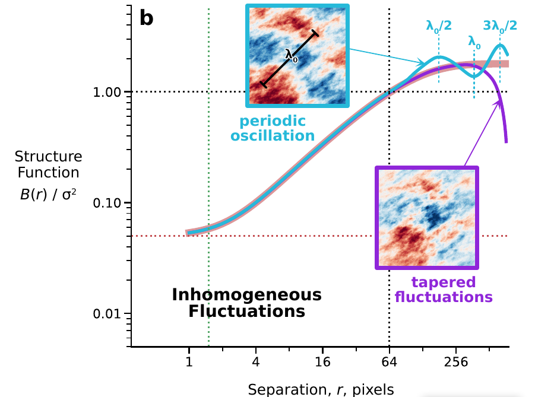

- Inhomogeneous Fluctuations

# What causes a U shaped pattern in the spatial correlogram?

- [What causes a U shaped pattern in the spatial correlogram?](https://stats.stackexchange.com/questions/100919/what-causes-a-u-shaped-pattern-in-the-spatial-correlogram)

>[!quote]
>- A u-shaped correlogram is a common occurrence when its calculation is carried out across the full extent of the region in which a phenomenon occurs. The correlogram summarizes the degree of similarity of all data according to their amount of spatial separation. Higher values are more similar, lower values less similar. 
>- The _only_ pairs of points at which the greatest spatial separation can be achieved are those lying at diametrically opposite sides of the map. The correlogram therefore is comparing values along the boundary to each other. When data values tend overall to decrease toward the boundary, the correlogram can only compare small values to small values. It likely will find them to be very similar. For any plume-like or other spatially unimodal phenomenon, therefore, we can anticipate _before ever collecting the data_ that the correlogram will likely decrease until about half the diameter of the region is reached and then it will begin to increase. 
>- A long standing rule of thumb in spatial statistics therefore is to avoid computing the correlogram at distances greater than half the diameter of the study area and to avoid to using such great distances for prediction (such as interpolation).
>- **What can be done** The correct way to proceed in such circumstances is to accept that the phenomenon is not stationary and to adopt a model that describes it in terms of some underlying _deterministic_ shape--a "drift" or "trend"--with additional fluctuations around that drift which may have spatial (and temporal) autocorrelation.
>- *What would the spatial autocorrelation plot from a chessboard look like?* I wonder if it wouldn't be high at close distances (same square), low a little further out (different square), & then higher again.

