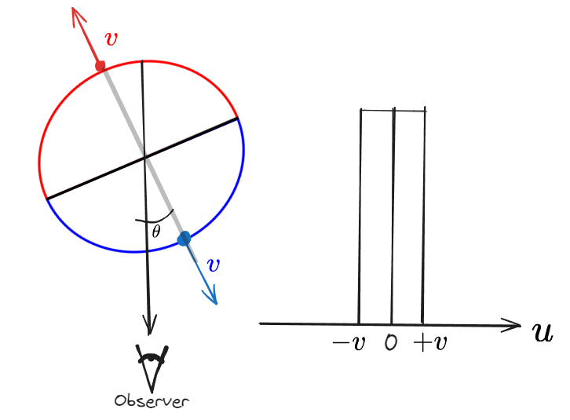

- Here we present an explanation for the observed velocity fluctuations in emission regions **without** using turbulence.
- The fluctuations in the velocity field are caused by emissivity fluctuations.
- This hypothesis is regarding the observational issue of $\sigma_\text{POS} < \sigma_\text{LOS}$ [[Arthur et al. 2016|1]] [[Garcia Vazquez et al 2023|2]].
- Taken from [Dr. Will notes](https://lights-cheat-n2s.craft.me/po4iajL37TL3jE) on the emissivity fluctuations. 

For an **homogeneous spherical shell** we have the following **rectangular profile**,

Therefore, using $$M_k = \int_{-v}^v u^n I(u) du $$
- Zero-moment
$$M_0 = \int_{-v}^v u^0 I(u) du = \int_{-v}^v I(u) du = \int_{-v}^v du$$
$$M_0 = \left.u \right|_{-v}^v = v - (-v) = 2v$$
- First-moment

$$M_1 = \int_{-v}^v u^1 I(u) du = \int_{-v}^v I(u)u du = \int_{-v}^v udu$$

$$M_1 = \left.\frac{1}{2}u^2 \right|_{-v}^v = \frac{1}{2}(v)^2-\frac{1}{2}(-v)^2 =0 = \overline{u} $$
"Furthermore, the spatially resolved line profile at any point will also have $\overline{u} =0$ so, that" $$\sigma_\text{POS} = 0. $$
- Second-moment

$$M_2 = \int_{-v}^v u^2 I(u) du = \int_{-v}^v I(u)u^2 du = \int_{-v}^v u^2du$$
$$ M_2 = \int_{-v}^{+v}u^2du=\left. \frac{u^3}{3} \right|_{-v}^v =\frac{1}{3}(v)^3-\frac{1}{3}(-v)^3 = \frac{2}{3}v^3$$
$$\sigma_\text{LOS}^2 = (M_2/M_0)-(M_1/M_0) = \frac{v^2}{3}$$
$$ \therefore \sigma_\text{LOS}=\frac{v}{\sqrt3}$$

---

Now, considering the shell is clumpy, in this case at any given position the red hemisphere has a brightness $S(1 + \varepsilon)$ and the blue hemisphere has a brightness $S(1 - \varepsilon)$,:

Therefore $$\overline{u}=\frac{v \cos \theta}{2}[1 + \epsilon -1 + \epsilon] = v \cos \theta \varepsilon$$ Using the expression  $$\overline{\cos \theta}= \frac{1}{2}$$ we have $$\overline{u}=\frac{1}{2}v \varepsilon = \varepsilon  \sigma_\text{LOS}$$
 So, if $\varepsilon_\text{RMS}$ is the variation in $\varepsilon$, then
$$\sigma_\text{POS}=\varepsilon_\text{RMS} \sigma_\text{LOS}$$

$$  \therefore \boxed{ \frac{\sigma_\text{POS}}{\sigma_\text{LOS}}= \varepsilon_\text{RMS}}$$
From observations $$ \frac{\sigma_\text{POS}}{\sigma_\text{LOS}}=0.5  = \frac{1}{2} =\varepsilon_\text{RMS} $$
The term $\varepsilon_\text{RMS}$ be determined after binning up the small scales (since $\sigma(E)$ is at the scale of the shell) as to the PDF of the emissivity: $$\varepsilon_\text{RMS} = \frac{\sigma(E)}{E}$$

## Velocity fluctuations and emissivity fluctuations relation

Considering $\mu$ "velocity fluctuations" and $\varepsilon$ emissivity fluctuations. 

- Red hemisphere: $u_R = \mu u \quad , \quad E_R = 1 + \varepsilon$
- Blue hemisphere: $u_B = -\mu u \quad , \quad E_B = 1 - \varepsilon$

$$E_R + E_B = 2$$

$$\overline{u} = \frac{E_R u_R + E_B u_B}{E_R + E_B}= \frac{1}{2} \mu v(\varepsilon-1)+\frac{1}{2} \mu v(\varepsilon+1) = \varepsilon \mu v \tag1$$

$$\sigma^2_{\text{los}} = \frac{1}{2} \left( \left( u_R - \overline{u}\right)^2 (1+\epsilon) + \left( u_B - \overline{u}\right)^2 (1-\epsilon) \right) = v^2 \mu^2 (1-\varepsilon^2) \tag2$$

So, computing the weighted average: 
$$\langle \sigma^2_{\text{los}}  \rangle_\text{pos} = \frac{\int_0 ^1  \sigma^2_{\text{los}} d \mu}{\int_0 ^1 d\mu} = \frac{v^2}{3}  (1-\varepsilon^2)$$ 

$$\therefore v^2 = 3 \langle \sigma^2_{\text{los}}   \rangle_\text{pos} (1-\varepsilon^2)^{-1} \tag3$$
 and $$\langle \overline{u}   \rangle_\text{pos} =\frac{ v \varepsilon\int_0 ^1  \mu d \mu}{\int_0 ^1 d\mu} = \frac{1}{2} v \varepsilon \ . \tag4$$
 
Now we write $\sigma_\text{los} = \sqrt{ \langle \sigma^2_{\text{los}}   \rangle_\text{pos}}$ as the RMS average over the $\text{pos}$: 

$$\sigma_\text{los} =  \frac{v}{\sqrt{3}}  \sqrt{(1-\varepsilon_\text{rms}^2)} \tag5$$

Squaring (4) and substituting (3) and (5):

$$\sigma^2_\text{pos} ( \overline{u})   = \frac{1}{4} v^2 \varepsilon_\text{rms}^2 \ = \frac{3}{4} ( \langle \sigma^2_{\text{los}}   \rangle_\text{pos} )\frac{\varepsilon_\text{rms}^2}{(1-\varepsilon_\text{rms}^2)}$$

$$\boxed{\sigma^2_\text{pos} ( \overline{u})   = \frac{3}{4} \frac{\varepsilon_\text{rms}^2}{(1-\varepsilon_\text{rms}^2)} \sigma_\text{los}^2 \ . }$$

Now we assume $x = \sigma_\text{pos} /\sigma_\text{los}$:

$$x^2 = \frac{3}{4} \frac{\varepsilon_\text{rms}^2}{(1-\varepsilon_\text{rms}^2)}$$

$$ x^2 (1-\varepsilon_\text{rms}^2)= \frac{3}{4}\varepsilon_\text{rms}^2 \ \therefore \ x^2-x^2\varepsilon_\text{rms}^2 -\frac{3}{4}\varepsilon_\text{rms}^2 =0$$

$$ \varepsilon_\text{rms}^2 \left(-x^2  - 3/4\right)  =-x^2$$

$$\boxed{ \varepsilon_\text{rms} = \left( \frac{x^2}{x^2  + 3/4} \right)^{1/2} }$$

With  $x =1/2$ we have $\varepsilon_\text{rms} =1/2$.

Alternatively, ditch the $1/(1-\varepsilon_\text{rms}^2)$  term since the will be outer fluctuations too:

$$ \varepsilon_\text{rms} \sim \frac{2}{\sqrt{3}}x\sim 1.15 \frac{ \sigma_\text{pos}}{\sigma_\text{los}}$$

# Toy model

