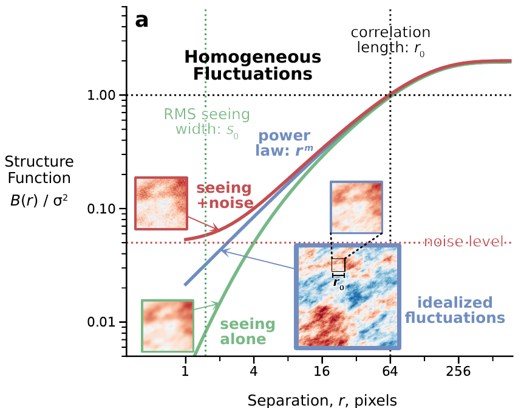

# Definition

 In order to probe the dependence of the *velocity fluctuations on spatial scale*, the primary tool that we employ is the **second-order structure function** of differences in *velocity centroids*, $B(r)$, which is a function of the scalar separation or lag, $r$, between two points on the plane of the sky: 

$$ B(r) = \left\langle 
\bigl[
V_{c}(\boldsymbol{x}_j) - V_{c}(\boldsymbol{x}_i) 
\bigr]^{2} 
\right\rangle_{ | \boldsymbol{x}_j - \boldsymbol{x}_i | \ \approx \ r} \ .
$$

The averaging is performed over all pairs of points $(i, j)$ whose scalar separation $|\boldsymbol{x}_j - \boldsymbol{x}_i|$ is close to $r$, irrespective of the orientation of the separation vector. In practice, we achieve this by binning the separations with a constant logarithmic width of $0.05 \ \text{dex}$.

- Relation with the [autocorrelation function](<Autocorrelation Function.md>) $C(r):$

$$ B(r) = 2\sigma^2 \bigl[   1 - C(r)\bigr] .$$

## Heuristic model for H II regions [1](https://ui.adsabs.harvard.edu/abs/2023MNRAS.523.4202G/abstract)

A common property of **homogeneous fluctuating** (for properties of inhomogeneous fluctuations see [here](<../../Turbulence ISM/Large scale effects on the structure function.md>)) velocity fields is that neighboring points tend to have similar velocities ($C(r) \approx 1$ for small $r$), whereas points that are far apart may have very different velocities $(C(r) \ll 1$ for large $r)$. The value of the separation that corresponds to the transition between these two regimes
is called the [correlation length](<../../Turbulence ISM/Correlation length in H II Regions.md>), $r_0$.

In the simplest case, two points separated by $r \gg r_0$ have totally uncorrelated velocities
in the sense that knowledge of the velocity at the first point is of no help in predicting the velocity at the second point. At scales smaller than $r_0$, the fluctuations often show a power-law behavior as a function of $r$.

In order to capture these two behaviors, we therefore propose the following idealized 2-parameter model for the autocorrelation function:

$$
  C_\text{mod}(r;\ r_0, m) = 2^{- \left( r/r_0 \right)^m} 
$$

in which $r_{0}$ is the [correlation length](<../../Turbulence ISM/Correlation length in H II Regions.md#Correlation length values>) and $m$ is the power-law slope at small scales.
This is constructed so that

$$
C_\text{mod}(r) = 1/2 \  \ \text{at} \ \ r = r_0\,
$$

while the exponential form ensures that $C(r)$ rapidly approaches zero for larger separations.

We assume the validity of equation structurefunction-correlation relation to determine the structure function from this model autocorrelation function:

$$
  B_\text{mod}(r) = 2\sigma^2_\text{pos} \left[
    1 - 2^{- \left( r/r_0 \right)^m} 
  \right]
$$

This has the following properties:

 1. Small scales: $B_\text{mod}(r) \propto r^m$ for $r \ll r_0$;
 2. Correlation scale: $B_\text{mod}(r_0) = \sigma^2_\text{pos}$;
 3. Large scales: $B_\text{mod}(r) \to 2 \sigma^2_\text{pos}$ for $r \gg r_0$.

## B(r) relation with C(r)

We want to prove that:

$$ B(r) = 2\sigma^2 \bigl[   1 - C(r)\bigr] .$$

 Normalized functions indicated with an $*$:

$$C(r)^*=\dfrac{\sum [a(x+r)\cdot a(x) ]}{\sigma^{2} N(r)}$$

$$B(r)^*=\dfrac{\sum [a(x+r)-a(x) ]^{2}  }{\sigma^{2} N(r) }$$

We have

$$F_{1} = a(x)$$
and 

$$F_{2} = a(x+r)$$ We write:

$$ 
B(r)^*=\langle (F_{2}-F_{1})^{2} \rangle
$$

$$
=\langle F_{2}^{2} \rangle -2\langle F_{2}F_{1}\rangle +\langle F_{1}^{2} \rangle $$

$$
\langle F_{2}^{2} \rangle = \langle F_{1}^{2} \rangle = \sigma^2 = C(0) \therefore \langle F_{2}^{2} \rangle = \langle F_{1}^{2} \rangle = 1 = C(0)^* 
$$

where $\sigma^2$ is the variance of $a(x)$. So:

$$
B(r)^*= 2-2\langle F_{2}F_{1}\rangle = 2(1-a(x+r)a(x))
$$

$$
B(r)^* = 2 [1-C(r)^*]
$$

$$
B(r) = 2 \sigma ^2 [1-C(r)]
$$

# Structure function relation with turbulence

$$B(r)\propto (\varepsilon r )^{2 / 3} $$

# Other definitions

- Vector form:

$$B(r)=\langle {\vert \vec{v}(\vec{x}+\vec{r})-\vec{v}(\vec{x}) \vert}^{2} \rangle  $$

- From [Arthur et al 2016](https://ui.adsabs.harvard.edu/abs/2016MNRAS.463.2864A/abstract)

$$S_2(l) = \frac{\sum_{\text{pairs}} [V_c(r) - V_c(r + l)]^2}{\sigma^2_\text{vc} N(l)}.$$

- $r$ is the two-dimensional position vector in the plan of the sky.
- $l$ is the separation vector.
- $N(l)$ Number of pair of points at each separation.
- $\sigma^2_\text{vc}$ the variance of the centroid velocity fluctuations: 

$$\sigma^2_{v_c} = \frac{\sum_{\text{pixels}} [V_c(r) - (V_c)]^2}{N}.
 $$

- $V_c$ is the mean centroid velocity: 

$$V_c = \frac{\sum_{\text{pixels}} V_c(r)}{N}.$$

**Intensity weighted** structure function by 

$$S_2(l) = \frac{\sum_{\text{pairs}} [V_c(r) - V_c(r + l)]^2 I(r) I(r + l)}{\sigma^2_{v_c} W(l)},$$

where $W(l)$: 

$$W(l) = \sum_{\text{pairs}} I(r) I(r + l),$$