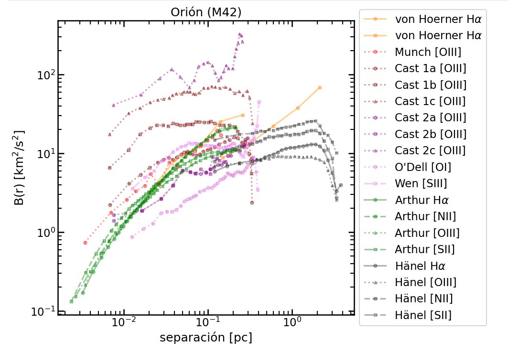
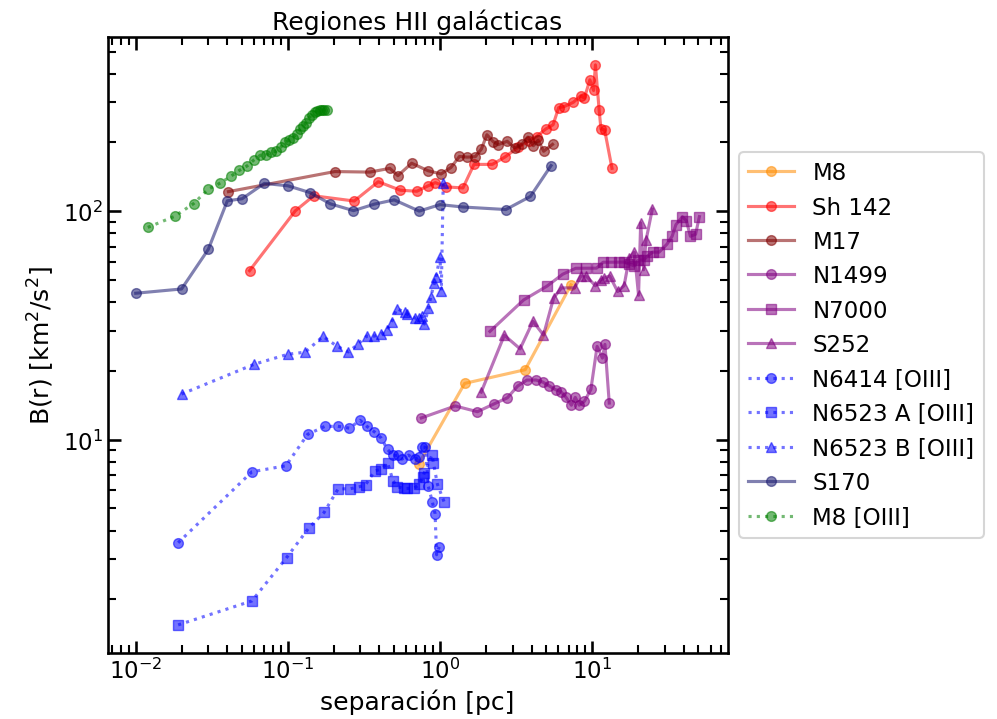
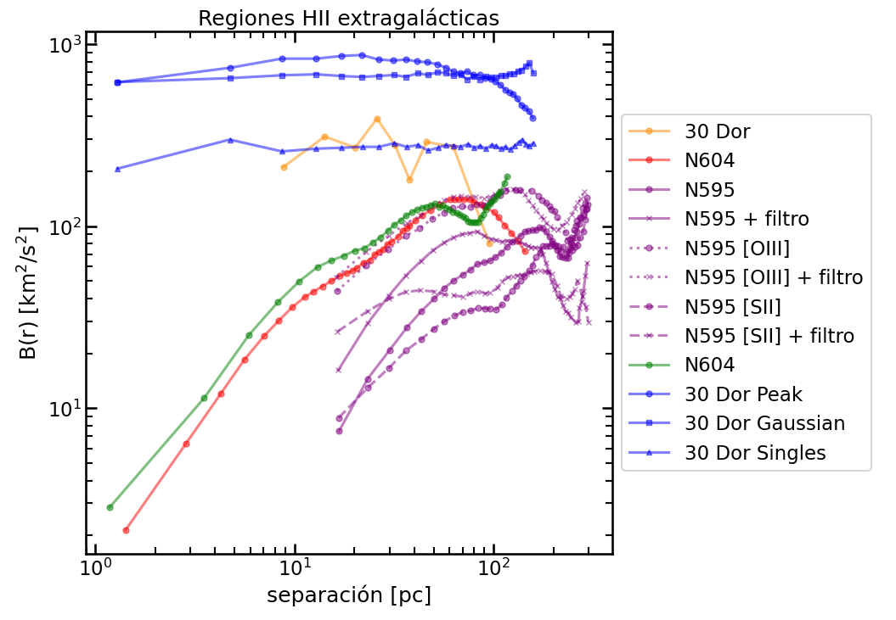

# M 42

| Article                                                                              | Sub region | Emission line                     | $\sigma_\text{POS}$ [km/s] | Correlation length $r_0$ | $m$ [-]       | Notes |
| ------------------------------------------------------------------------------------ | ---------- | --------------------------------- | -------------------------- | ------------------------ | ------------- | ----- |
| Arthur et al. 2016                                                                   |            | $\text{H}\alpha$                  |                            | 0.02 - 0.06 pc           | $1.17 (0.08)$ |       |
|                                                                                      |            | $\text{[OIII]}$                   |                            |                          | $1.18 (0.09)$ |       |
|                                                                                      |            | $\text{[SII]}$                    |                            |                          | $0.80 (0.12)$ |       |
|                                                                                      |            | $\text{[NII]}$                    |                            |                          | $0.82 (0.11)$ |       |
| [McLeod et al. 2016](https://ui.adsabs.harvard.edu/abs/2016MNRAS.455.4057M/abstract) |            | $\text{H}\alpha$                  |                            |                          | $0.42$        |       |
|                                                                                      |            | $\text{[OIII]}$                   |                            |                          | $0.29$        |       |
|                                                                                      |            | $\text{[SII]}$                    |                            |                          | $0.05$        |       |
|                                                                                      |            | $\text{[OI]}  630 \text{ nm}$     |                            |                          | $0$           |       |
| [Wen & ODell 1993](https://ui.adsabs.harvard.edu/abs/1993ApJ...409..262W/abstract)   |            | $\text{[SIII]}  631.2 \text{ nm}$ |                            |                          | $0.92$        |       |
| [ODell & Wen 1992](https://ui.adsabs.harvard.edu/abs/1992ApJ...387..229O/abstract)   |            | $\text{[OI]}  630 \text{ nm}$     |                            |                          | $0.68$        |       |
| Castañeda 1988                                                                       |            | $\text{[OIII]}$                   |                            |                          |               |       |
| Munch 1958                                                                           |            | $\text{[OIII]}$                   | $7.4$                      |                          | 2/3           |       |
| von Hoerner 1951                                                                     |            | $\text{[OIII]}$                   | -                          | -                        | 2/3           |       |
| Courtes                                                                              |            |                                   |                            |                          |               |       |

# Compact to normal H II regions

| Article                                                                                          | Region   | Sub region | Emission line    | $\sigma_\text{POS}$ [km/s] | Correlation length $r_0$ | $m$ [-]    | Notes                                                                                                       |
| ------------------------------------------------------------------------------------------------ | -------- | ---------- | ---------------- | -------------------------- | ------------------------ | ---------- | ----------------------------------------------------------------------------------------------------------- |
| [Chakraborty & Anandarao 1999](https://ui.adsabs.harvard.edu/abs/1999A%26A...346..947C/abstract) | M 8      |            | $\text{[OIII]}$  |                            |                          | $0.46$     |                                                                                                             |
| [Miville-Deschenes et al. 1995](https://ui.adsabs.harvard.edu/abs/1995ApJ...454..316M/abstract)  | Sh 170   |            | $\text{H}\alpha$ | $8.70(0.05)$               | $0.7$                    | $0.8(0.1)$ | 12,695 points Fabry-Perot 1.60-m OmM                                                                     |
| [ODell & Castaneda 1987](https://ui.adsabs.harvard.edu/abs/1987ApJ...317..686O/abstract)         | NGC 6514 |            | $\text{[OIII]}$  |                            |                          |            | KPNO Uses data from [ODell 1986](https://ui.adsabs.harvard.edu/abs/1986ApJ...304..767O/abstract)         |
|                                                                                                  | NGC 6523 |            | $\text{[OIII]}$  |                            |                          |            |                                                                                                             |
| [ODell 1986](https://ui.adsabs.harvard.edu/abs/1986ApJ...304..767O/abstract)                     | NGC 1499 |            | $\text{H}\alpha$ |                            | no value reported        | $0.18$     | Espectrografía echelle del Observatorio Yerkes                                                              |
|                                                                                                  | NGC 7000 |            | $\text{H}\alpha$ |                            | no value reported        | $0.30$     |                                                                                                             |
|                                                                                                  | S252     |            | $\text{H}\alpha$ |                            | no value reported        | $0.42$     |                                                                                                             |
| [Roy et al. 1986](https://ui.adsabs.harvard.edu/abs/1986ApJ...300..624R/abstract)                | M 17     |            |                  |                            |                          |            | Alsho shows data from [Roy and Joncas 1985](https://ui.adsabs.harvard.edu/abs/1985ApJ...288..142R/abstract) |
| [Roy and Joncas 1985](https://ui.adsabs.harvard.edu/abs/1985ApJ...288..142R/abstract)            | S142     |            | $\text{H}\alpha$ |                            |                          | 1          | correlation scale: 1.6 - 9 pc Fabry-Perot 1.60-m OmM                                                     |
| [Louise & Monnet 1970](https://ui.adsabs.harvard.edu/abs/1970A%26A.....8..486L/abstract)         | M 8      |            | $\text{H}\alpha$ |                            |                          | 2/3-2      | Observations from \citet{1960AnAp...23..115C} with \num{10000} points.                                      |
|                                                                                                  |          |            |                  |                            |                          |            |                                                                                                             |

# Giant H II regions

| Article                                                                                 | Region           | Sub region | Emission line    | $\sigma_\text{POS}$ [km/s] | Correlation length $r_0$ | $m$ [-]           | Notes                                                                                         |
| --------------------------------------------------------------------------------------- | ---------------- | ---------- | ---------------- | -------------------------- | ------------------------ | ----------------- | --------------------------------------------------------------------------------------------- |
| [Melnick et al. 2021](https://ui.adsabs.harvard.edu/abs/2019arXiv191203543M/abstract)   | NGC 2070\|30 Dor |            | $\text{H}\alpha$ |                            | -                        | -                 | VLT-FLAMES/GIRAFFE No correlation found. Interpretation as virial equilibrium.             |
|                                                                                         | NGC 604          |            | $\text{H}\alpha$ |                            | -                        | -                 | Data from [Tanco et al. 1997](https://ui.adsabs.harvard.edu/abs/1997ApJ...487..163M/abstract) |
| [Lagrois & Joncas 2011](https://ui.adsabs.harvard.edu/abs/2011MNRAS.413..721L/abstract) | NGC 595          |            | $\text{H}\alpha$ |                            |                          |                   |                                                                                               |
|                                                                                         | NGC 595          |            | $\text{[SII]}$   |                            |                          |                   |                                                                                               |
|                                                                                         | NGC 595          |            | $\text{[OIII]}$  |                            |                          |                   |                                                                                               |
| [Tanco et al. 1997](https://ui.adsabs.harvard.edu/abs/1997ApJ...487..163M/abstract)     | NGC 604          |            | $\text{H}\alpha$ |                            | no value reported        | no value reported |                                                                                               |
| [Feast 1961](https://ui.adsabs.harvard.edu/abs/1961MNRAS.122....1F/abstract)            | NGC 2070\|30 Dor |            |                  |                            |                          |                   | 37 points                                                                                     |

